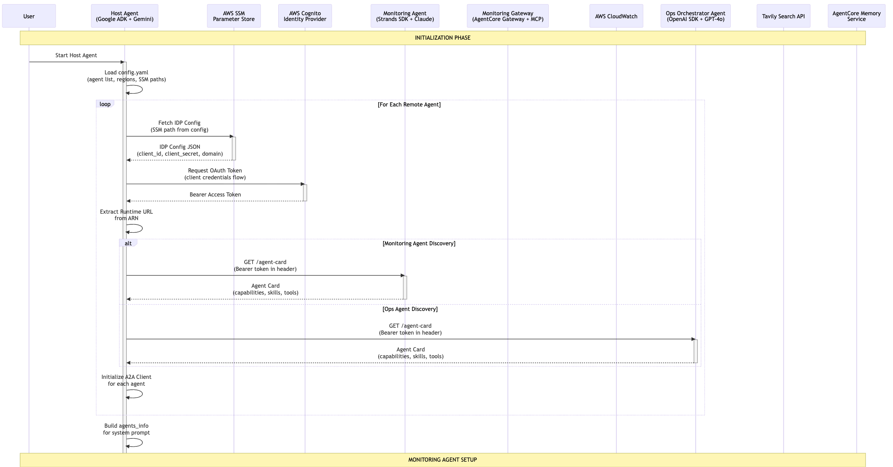
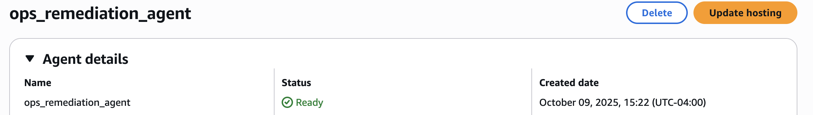

# Agent-to-Agent (A2A) Multi-Agent System on Amazon Bedrock AgentCore for Incident Response Logging

A comprehensive implementation of the Agent-to-Agent (A2A) protocol using specialized agents running on Amazon Bedrock `AgentCore` runtime, demonstrating intelligent coordination for AWS infrastructure monitoring and operations management. This repository walks you through setting up three core agents to answer questions about incidents and metrics in your AWS accounts and search for best remediation strategies. A monitoring agent (built using the `Strands` Agents SDK) is responsible for handling all questions related to metrics and logs within AWS and cross AWS accounts. A remediation agent (built using `OpenAI`'s Agents SDK) is responsible to doing efficient web searches for best remediation strategies and optimization techniques that the user can ask for. Both agents run on separate runtimes as `A2A` servers and utilize all `AgentCore` primitives - memory for context management, observability for deep level analysis about both agents, gateway for access to tools (`Cloudwatch`, `JIRA` and `TAVILY` APIs) and `AgentCore` identity for enabling inbound and outbound access into the agent and then into the resources that the agent can access using OAuth 2.0 and APIs. These two agents are then managed by a host `Google ADK` agent that acts as a client and delegates tasks to each of these agents using A2A on Runtime. The Google ADK host agent runs on a separate `AgentCore` runtime of its own. 

## What is A2A?

**Agent-to-Agent (A2A)** is an open standard protocol that enables seamless communication and collaboration between AI agents across different platforms and implementations. The A2A protocol defines:

- **Agent Discovery**: Standardized agent cards that describe capabilities, skills, and communication endpoints
- **Communication Format**: JSON-RPC 2.0-based message format for reliable agent-to-agent communication
- **Authentication**: OAuth 2.0-based security model for secure inter-agent communication
- **Interoperability**: Platform-agnostic design allowing agents from different frameworks to collaborate

Learn more about the A2A protocol: [A2A Specification](https://a2a.foundation/)

## A2A Support on Amazon Bedrock AgentCore

Amazon Bedrock AgentCore provides native support for the A2A protocol, enabling you to:

- **Deploy A2A-compliant agents** as runtime services with automatic endpoint management
- **Secure authentication** via AWS Cognito OAuth 2.0 integration
- **Agent discovery** through standardized agent card endpoints
- **Scalable deployment** leveraging AWS infrastructure for production workloads
- **Built-in observability** with CloudWatch integration and OpenTelemetry support

AgentCore simplifies A2A agent deployment by handling infrastructure, authentication, scaling, and monitoring automatically.

## System Architecture

```
┌────────────────────────────────────────────────────────────────────┐
│                        Host Orchestrator Agent                     │
│                    (Google ADK + A2A Protocol)                     │
│  • Fetches IDP configuration from SSM Parameter Store              │
│  • Discovers remote agents via agent cards                         │
│  • Routes requests to appropriate specialist agents                │
│  • Coordinates multi-agent collaboration                           │
└────────────────────────────────────────────────────────────────────┘
                                  │
                    ┌─────────────┴──────────────┐
                    │    A2A Protocol (OAuth)    │
                    │   JSON-RPC 2.0 Messages    │
                    └─────────────┬──────────────┘
                                  │
          ┌───────────────────────┴────────────────────────┐
          │                                                 │
┌─────────▼──────────────┐                   ┌────────────▼────────────┐
│  Monitoring Agent      │                   │  Ops Orchestrator Agent │
│  (Bedrock AgentCore)   │                   │  (Bedrock AgentCore)    │
│                        │                   │                         │
│  • CloudWatch logs     │                   │  • Web search for best  │
│  • Metrics analysis    │                   │    practices            │
│  • Dashboard review    │                   │  • JIRA ticket creation │
│  • Alarm management    │                   │  • Remediation guidance │
│  • A2A Server (port    │                   │  • A2A Server (port     │
│    9000)               │                   │    9000)                │
└────────────────────────┘                   └─────────────────────────┘
```

## Sequence flow



## Agent Overview and Steps to run

### Prerequisite steps

Execute the following command in your terminal to instantiate the `uv` environment and make sure you have `aws configure`d into your AWS account:

```bash
curl -LsSf https://astral.sh/uv/install.sh | sh
export PATH="$HOME/.local/bin:$PATH"
uv venv && source .venv/bin/activate && uv pip sync pyproject.toml
UV_PROJECT_ENVIRONMENT=.venv
uv add zmq
python -m ipykernel install --user --name=.venv --display-name="Python (uv env)"
```


### 1. Monitoring Agent

The Monitoring Agent provides comprehensive AWS infrastructure monitoring capabilities using Amazon Bedrock `AgentCore` runtime.

**Key Features:**
- CloudWatch logs, metrics, and dashboard analysis
- Alarm management and investigation
- Log pattern detection and error analysis
- JIRA ticket creation for incidents
- A2A protocol support for agent collaboration

**[Complete Setup Guide →](./multi-agents/monitoring_agent/README.md)**


### 2. Ops Orchestrator Agent

The Ops Orchestrator Agent searches for best practices and provides infrastructure remediation guidance.

**Key Features:**
- Web search for AWS best practices and documentation
- JIRA ticket creation and management
- Infrastructure troubleshooting guidance
- Remediation strategy recommendations
- A2A protocol support for agent collaboration

**[Complete Setup Guide →](./multi-agents/ops_orchestrator_agent/README.md)**



### 3. Host Orchestrator Agent

The Host Orchestrator serves as an intelligent router that coordinates communication between specialist agents.

**Key Features:**
- Automatic agent discovery via A2A agent cards
- IDP configuration management via AWS SSM Parameter Store
- OAuth 2.0 token management and refresh
- Intelligent request routing to appropriate agents
- Multi-agent task coordination

**[Complete Setup Guide →](./multi-agents/host/README.md)**

## Quick Start

### High-Level Setup Steps

1. **Deploy the Monitoring Agent**
   - Set up Lambda monitoring tools
   - Configure Cognito authentication
   - Create AgentCore gateway
   - Deploy agent runtime as A2A server
   - [Detailed Instructions →](./multi-agents/monitoring_agent/README.md)

2. **Deploy the Ops Orchestrator Agent**
   - Store API keys in SSM Parameter Store
   - Configure Cognito authentication
   - Deploy agent runtime as A2A server
   - [Detailed Instructions →](./multi-agents/ops_orchestrator_agent/README.md)

3. **Deploy the Host Orchestrator**
   - Store IDP configurations in SSM Parameter Store
   - Configure agent endpoints in `config.yaml`
   - Run the host orchestrator
   - [Detailed Instructions →](./multi-agents/host/README.md)

### Testing A2A Communication

Once all agents are deployed, test the A2A protocol:

```bash
# Test monitoring agent
curl -X POST http://localhost:9000 \
  -H "Content-Type: application/json" \
  -d '{
    "jsonrpc": "2.0",
    "id": "req-001",
    "method": "message/send",
    "params": {
      "message": {
        "role": "user",
        "parts": [{"kind": "text", "text": "Check CloudWatch logs for errors"}],
        "messageId": "msg-001"
      }
    }
  }' | jq .

# Fetch agent card
curl http://localhost:9000/.well-known/agent-card.json | jq .
```

## A2A Protocol Implementation

### Agent Discovery

Each agent exposes a standardized agent card at:
```
https://{agent-id}.runtime.bedrock-agentcore.{region}.amazonaws.com/.well-known/agent-card.json
```

The agent card describes:
- Agent capabilities and skills
- Communication protocols supported
- Input/output modes
- Authentication requirements

### Message Format

A2A communication uses JSON-RPC 2.0:

```json
{
  "jsonrpc": "2.0",
  "id": "unique-request-id",
  "method": "message/send",
  "params": {
    "message": {
      "role": "user",
      "parts": [
        {
          "kind": "text",
          "text": "Your query here"
        }
      ],
      "messageId": "unique-message-id"
    }
  }
}
```

### Authentication

- **OAuth 2.0 Client Credentials Flow**: Agents authenticate using Cognito
- **Bearer Tokens**: JWT tokens included in Authorization headers
- **IDP Configuration**: Stored securely in AWS SSM Parameter Store
- **Automatic Token Refresh**: Tokens refreshed transparently as needed

## Security

### Security Features

- **Transport Security**: All communications use HTTPS
- **Token-Based Authorization**: OAuth 2.0 with fine-grained scopes
- **Centralized Secret Management**: IDP credentials stored in SSM Parameter Store
- **Encryption at Rest**: SSM SecureString parameters encrypted with KMS
- **Access Control**: IAM policies control parameter access
- **Audit Trail**: CloudTrail logs all parameter and API access

### IAM Best Practices

Use least-privilege IAM policies:

```json
{
  "Version": "2012-10-17",
  "Statement": [
    {
      "Effect": "Allow",
      "Action": [
        "ssm:GetParameter"
      ],
      "Resource": "arn:aws:ssm:*:*:parameter/a2a/agents/*"
    },
    {
      "Effect": "Allow",
      "Action": [
        "cognito-idp:InitiateAuth"
      ],
      "Resource": "arn:aws:cognito-idp:*:*:userpool/*"
    }
  ]
}
```

## Use Cases

### Incident Response Workflow

```
User → Host Orchestrator: "We're seeing high error rates in production"
       ↓
Host → Monitoring Agent: "Analyze CloudWatch logs for errors"
       ↓
Monitoring Agent → Host: "Found 50 errors in Lambda function X"
       ↓
Host → Ops Orchestrator: "Search for solutions to Lambda error Y"
       ↓
Ops Orchestrator → Host: "AWS best practice recommends increasing memory"
       ↓
Host → User: "Identified issue in Lambda X. Recommended fix: increase memory"
```

### Proactive Monitoring

```
Host → Monitoring Agent: "Check all CloudWatch alarms"
       ↓
Monitoring Agent → Host: "3 alarms firing for RDS"
       ↓
Host → Ops Orchestrator: "Create JIRA tickets for RDS alarms"
       ↓
Ops Orchestrator → Host: "Created ticket INFRA-123"
       ↓
Host → User: "Created incident tickets for RDS issues"
```

## Development Workflow

### Adding New Agents

1. Create agent with A2A protocol support
2. Deploy to Bedrock AgentCore runtime
3. Store IDP configuration in SSM Parameter Store
4. Add agent to host orchestrator configuration
5. Test agent discovery and communication

### Testing

```bash
# Test local agent
python monitoring_agent.py

# Test agent card retrieval
curl http://localhost:9000/.well-known/agent-card.json

# Test A2A communication
curl -X POST http://localhost:9000 \
  -H "Content-Type: application/json" \
  -d '{"jsonrpc": "2.0", ...}'
```

## Troubleshooting

### Common Issues

**Agent Discovery Fails**
- Verify runtime ARN in configuration
- Check OAuth credentials in SSM Parameter Store
- Ensure IAM permissions for SSM parameter access

**Authentication Errors**
- Verify Cognito IDP configuration
- Check client ID and secret
- Ensure OAuth scopes are correct

**A2A Communication Fails**
- Verify agent is running on port 9000
- Check agent card endpoint is accessible
- Ensure bearer token is valid and not expired

**AgentCore Runtime Issues**
- Check CloudWatch logs for error messages
- Verify IAM execution role permissions
- Ensure runtime status is READY

## AWS Bedrock AgentCore Primitives

This implementation showcases sophisticated usage of AgentCore primitives:

- **Memory Management**: User preferences, semantic memory, and session summaries
- **Gateway Architecture**: MCP-based gateway with OAuth 2.0 authentication
- **Runtime Management**: Flexible invocation patterns (local and remote ARN-based)
- **Observability**: OpenTelemetry integration with CloudWatch logging
- **Tool Integration**: Lambda functions, OpenAPI specs, and Smithy models

## Documentation

For detailed documentation on each component:

- [Monitoring Agent Setup Guide](./multi-agents/monitoring_agent/README.md)
- [Ops Orchestrator Agent Setup Guide](./multi-agents/ops_orchestrator_agent/README.md)
- [Host Orchestrator Setup Guide](./multi-agents/host/README.md)

## Additional Resources

- [A2A Protocol Specification](https://a2a.foundation/)
- [Amazon Bedrock AgentCore Documentation](https://docs.aws.amazon.com/bedrock-agentcore/)
- [Strands Agents SDK](https://github.com/strandsai/strands-agents)
- [Google ADK](https://github.com/google/adk)

## Contributing

Contributions are welcome. Please ensure:

- All agents implement A2A protocol correctly
- Authentication uses OAuth 2.0 with Cognito
- Secrets are stored in SSM Parameter Store
- Code follows AWS security best practices
- Documentation is updated for new features

## License

See [LICENSE](./LICENSE) file for details.
