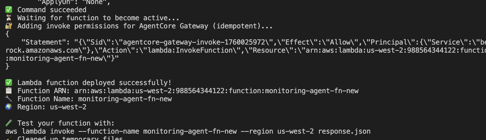
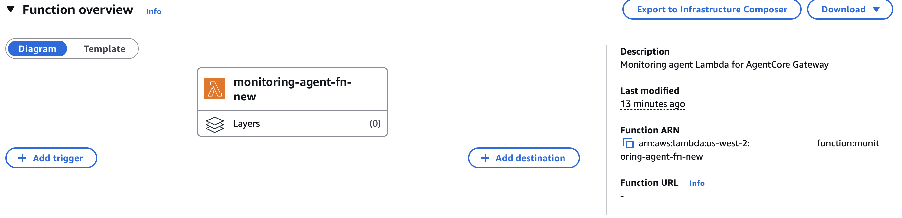
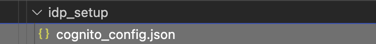
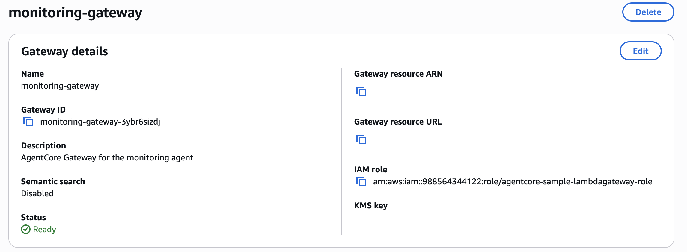
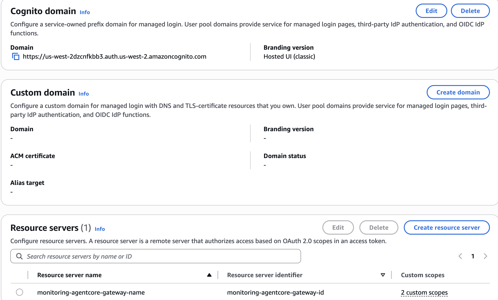

# Monitoring Agent - Complete Setup Guide

This monitoring agent is built using AWS Bedrock `AgentCore` runtime for monitoring CloudWatch logs, metrics, dashboards, and other AWS services. This guide provides step-by-step instructions for complete setup from Lambda functions to runtime deployment.

## Prerequisites

Create the `uv` environment as provided in the top level `README.md` file.

## Overview

The setup process consists of 4 main steps:
1. **Lambda Tools Setup** - Deploy monitoring tools as Lambda functions that will sit behind AgentCore Gateway
2. **Cognito Authentication** - Set up inbound authentication for the agent to be accessed via OAuth 2.0. We will use `Cognito` in this example but you can bring in your own agent.
3. **Gateway Creation** - Create AgentCore Gateway with authentication. In this case, the outbound authentication is done using the IAM role that has access to cloudwatch APIs registered as tools within the gateway. 
4. **Agent Runtime** - Deploy and test the monitoring agent. The monitoring agent is deployed as an A2A server on AgentCore Runtime. For more information on A2A server deployment on AgentCore, view this [documentation](https://docs.aws.amazon.com/bedrock-agentcore/latest/devguide/runtime-a2a.html).

## Step 1: Lambda Tools Setup

First, set up the Lambda functions that contain the monitoring tools the agent will use.

### 1.1 Navigate to Lambda Tools Directory

```bash
cd multi-agents/monitoring_agent/tools/lambda
```

### 1.2 Configure Lambda Deployment

The Lambda configuration is controlled by `tools/lambda_monitoring_tools.json`. Verify the configuration:

```json
{
  "target_type": "lambda",
  "lambda_config": {
    "function_name": "MonitoringAgentLambda",
    "runtime": "python3.12",
    "handler": "lambda_function.lambda_handler",
    "timeout": 300,
    "memory_size": 512,
    "create_lambda": true
  },
  "tools": [...]
}
```

### 1.3 Deploy Lambda Functions

Deploy the monitoring tools Lambda function:

```bash
# Make the deployment script executable
chmod +x deploy_lambda.sh

# Deploy the Lambda function
./deploy_lambda.sh
```

This will:
- Create an IAM role for the Lambda function
- Package and deploy the Lambda function with monitoring tools
- Set up necessary permissions for CloudWatch access



Copy the `lambda arn` from the AWS console below:



## Step 2: Cognito Authentication Setup

Set up Amazon Cognito for inbound authentication to the monitoring agent. For more information on how AgentCore identity works, view the documentation [here](https://docs.aws.amazon.com/bedrock-agentcore/latest/devguide/identity.html).

### 2.1 Navigate to IdP Setup Directory

```bash
cd ../../idp_setup
```

### 2.2 Run Cognito Setup

Execute the Cognito setup script:

```bash
python setup_cognito.py
```

You will be able to view the output of this command below in the `idp_setup/cognito_config.json` path:



This will:
- Create a Cognito User Pool
- Set up a resource server with appropriate scopes
- Create M2M (machine-to-machine) client credentials
- Generate a test user for authentication
- Save configuration to `cognito_config.json`

### 2.3 Record `Cognito` Configuration

The script will output important configuration details:

```
COGNITO SETUP COMPLETE
====================================
Pool ID: us-west-2_XXXXXXXXX
Client ID: XXXXXXXXXXXXXXXXXXXXXXXXXX
Discovery URL: https://cognito-idp.us-west-2.amazonaws.com/us-west-2_XXXXXXXXX/.well-known/jwks.json
Username: testuser
Password: MyPassword123!
M2M Client ID: XXXXXXXXXXXXXXXXXXXXXXXXXX
M2M Client Secret: XXXXXXXXXX...
====================================
```

Save these values - you'll need them for the gateway configuration.

## Step 3: Gateway Creation

Create the [AgentCore Gateway](https://docs.aws.amazon.com/bedrock-agentcore/latest/devguide/gateway.html) that will host the monitoring tools and handle authentication.

### 3.1 Navigate to Gateway Creation Directory

```bash
cd ../gateway_creation
```

### 3.2 Configure Gateway Setup

Update `setup_gateway.yaml` with your Cognito configuration:

```yaml
gateway_config:
  name: "monitoringgtw"
  description: "Monitoring Agent Gateway with CloudWatch and JIRA tools"
  
  # Authentication configuration from Cognito setup
  auth_info:
    client_id: "YOUR_COGNITO_CLIENT_ID"  # From Step 2.3. This is the m2m client id
    discovery_url: "YOUR_COGNITO_DISCOVERY_URL"  # From Step 2.3
  # this is the name of the bucket where the target files (openapi yaml) will
  # be uploaded from
  bucket_name: <bucket-name>
  # Lambda target configuration
  targets:
    lambda:
      role_arn: "<add the lambda function arn of the lambda function created from the previous step>"  # From Step 1
```

### 3.3 Create the Gateway

Run the gateway creation script:

```bash
python create_gateway.py
```

This will:
- Create an IAM role for the AgentCore Gateway
- Create the gateway with Cognito JWT authentication
- Create a gateway target pointing to your Lambda function
- Configure the gateway with monitoring tools schema

### 3.4 Record Gateway Information

The script will output gateway details:

```
Created the agentcore gateway for the monitoring agent: {...}
Gateway ID: gwXXXXXXXXXX
Gateway URL: https://XXXXXXXXXX.execute-api.REGION.amazonaws.com/
```

View the gateway created in the console and copy the `Gateway ID` and `Gateway MCP URL` from there. The agent will be configured to access the gateway using the gateway identity and will be able to list the tools and orchestrate requests between them.



# Prepare pre-requites to deploy the Agent as an A2A server on AgentCore Runtime

Deploy and test the monitoring agent runtime.

### 4.1 Navigate to Main Directory

```bash
cd ..
```

### 4.2 Update Agent Configuration

Update `config.yaml` with your setup information:

1. Provide

```yaml
agent_information:
  monitoring_agent_model_info:
    # Model configuration
    model_id: "anthropic.claude-3-5-sonnet-20241022-v2:0"
    model_parameters:
      max_tokens: 2048
      temperature: 0.1
    
    # Gateway configuration (from Step 3)
    gateway_config:
      gateway_name: "name of your gateway"
      gateway_url: "YOUR_GATEWAY_URL"

# fetch this information from the cognito_config.json file and the console
# this would be retrieved from SSM or Identity provider in prod.
idp_setup:
  user_pool_id: 
  domain: 
  discovery_url: 
  client_secret: 
  client_id: 
  resource_server_identifier:
  scopes:
    - 
    -

cloudwatch_agent_resources:
  # this is the log group name that will be used to create the log group
  # and the log stream
  # this should be the same as what is given in the .env file for 
  # observability 
  log_group_name: "" # provide this else it will be created
  # this is the log stream name that will be used to create the log stream
  # within the log group
  log_stream_name: "" # provide this else it will be created
```

View an example of the domain created to fetch information from and fill it out in the config.yaml file above:



## Running the Monitoring Agent as an A2A server
Strands Agents supports the Agent-to-Agent (A2A) protocol, enabling seamless communication between AI agents across different platforms and implementations.

The Agent-to-Agent protocol is an open standard that defines how AI agents can discover, communicate, and collaborate with each other.

### Option 1: Local Testing 

Test the agent locally in interactive mode:

```bash
python monitoring_agent.py
```


This will:
- Create a monitoring strands agent with specific tools and capabilities
- Wrap the monitoring agent to provide the A2A protocol compatibility
- Dynamically construct the correct UTL based on the deployment context using the agentcore `runtime` URL.
- A2A servers run on port `9000` by default in AgentCore runtime.

#### Test the A2A server locally

Open another terminal and run the following command to send a request to the agent running as the A2A server:

```bash
curl -X POST http://0.0.0.0:9000 \-H "Content-Type: application/json" \-d '{  "jsonrpc": "2.0",  "id": "req-001",  "method": "message/send",  "params": {  "message": {  "role": "user",  "parts": [  {  "kind": "text",  "text": "What are the cloudwatch logs for lambda in my AWS account?"  }  ],  "messageId": "d0673ab9-796d-4270-9435-451912020cd1"  }  } }' | jq .
```

This will fetch all of the cloudwatch logs for `Lambda` in your AWS account.

#### Test the agent card retrieval

- Run the following command to retrieve the agent card of the server:

```bash
curl http://localhost:9000/.well-known/agent-card.json | jq .
```

- Output:

```bash
{
  "capabilities": {
    "streaming": true
  },
  "defaultInputModes": [
    "text"
  ],
  "defaultOutputModes": [
    "text"
  ],
  "description": "A monitoring agent that handles CloudWatch logs, metrics, dashboards, and AWS service monitoring",
  "name": "monitoring_agent",
  "preferredTransport": "JSONRPC",
  "protocolVersion": "0.3.0",
  "skills": [
    {
      "description": "Analyze a specific CloudWatch log group for patterns and errors",
      "id": "MonitoringOpsTarget___analyze_log_group",
      "name": "MonitoringOpsTarget___analyze_log_group",
      "tags": []
    },
    {
      "description": "Create a simple issue in the Jira project backlog. Project and issue type are configured via environment variables.",
      "id": "MonitoringOpsTarget___create_incident_jira_ticket",
      "name": "MonitoringOpsTarget___create_incident_jira_ticket",
      "tags": []
    },
    {
      "description": "Fetch recent CloudWatch logs for a specific AWS service",
      "id": "MonitoringOpsTarget___fetch_cloudwatch_logs_for_service",
      "name": "MonitoringOpsTarget___fetch_cloudwatch_logs_for_service",
      "tags": []
    },
    {
      "description": "Get CloudWatch alarms for a specific service",
      "id": "MonitoringOpsTarget___get_cloudwatch_alarms_for_service",
      "name": "MonitoringOpsTarget___get_cloudwatch_alarms_for_service",
      "tags": []
    },
    {
      "description": "Get summary and configuration of a specific CloudWatch dashboard",
      "id": "MonitoringOpsTarget___get_dashboard_summary",
      "name": "MonitoringOpsTarget___get_dashboard_summary",
      "tags": []
    },
    {
      "description": "List all CloudWatch dashboards in the AWS account",
      "id": "MonitoringOpsTarget___list_cloudwatch_dashboards",
      "name": "MonitoringOpsTarget___list_cloudwatch_dashboards",
      "tags": []
    },
    {
      "description": "List all CloudWatch log groups in the account",
      "id": "MonitoringOpsTarget___list_log_groups",
      "name": "MonitoringOpsTarget___list_log_groups",
      "tags": []
    },
    {
      "description": "Setup and verify cross-account access for monitoring",
      "id": "MonitoringOpsTarget___setup_cross_account_access",
      "name": "MonitoringOpsTarget___setup_cross_account_access",
      "tags": []
    }
  ],
  "url": "http://127.0.0.1:9000/",
  "version": "1.0.0"
}
```


### Option 2: Deploy your A2A server to Bedrock AgentCore Runtime

To deploy this A2A server on `AgentCore` runtime, follow the steps below:

1. Make sure that the Amazon Bedrock `AgentCore` CLI is installed. The `uv` environment contains the required packages preinstalled. If not, then run the following command in the terminal below:

```bash
uv pip install bedrock-agentcore-starter-toolkit
```
2. Set up Cognito user pool for authentication: In this case, we will be re-using the OAuth information of the agent from the `multi-agents/monitoring_agent/idp_setup` step. To configure your own IdP information to enable OAuth with the agent running on Runtime, see [Set up Cognito user pool for authentication](https://docs.aws.amazon.com/bedrock-agentcore/latest/devguide/runtime-mcp.html#set-up-cognito-user-pool-for-authentication) in the documentation. This provides the OAuth tokens required for secure access to your deployed server.

4. **Configure your A2A server for deployment**

After setting up authentication, create the deployment configuration:

```bash
agentcore configure -e monitoring_agent.py --protocol A2A
```

5. **Deploy to AWS**

Deploy your agent to `AgentCore` runtime:

```bash
agentcore launch
```

6. **Fetch the agent card using OAuth 2.0**

Run the following script that will generate the access token to invoke the `agent card` URL to fetch the agent card available via AgentCore runtime:

```bash
cd multi-agents
python retrieve_agent_card.py
```

This script will prompt you for the following information:

1. Agent ARN (use the agent arn from the `.bedrock_agentcore.yaml`) file.
2. OAuth 2.0 information (Discovery URL, allowed `client IDs`)

Once done, this script will generate the bearer token and invoke the agent running on `AgentCore` Runtime as an A2A server and invoke the `agent card` URL to get the agent card (same agent card provided above).

Now you should have an agent running as an A2A server on `AgentCore` Runtime utilizing all AgentCore primitives for monitoring services via Amazon CloudWatch.

### Next steps

Repeat the next steps for the `ops_agent` and navigate to the `A2A` directory for bringing all agents together.

